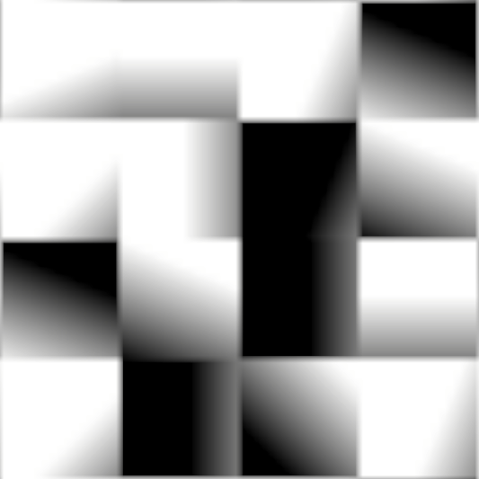
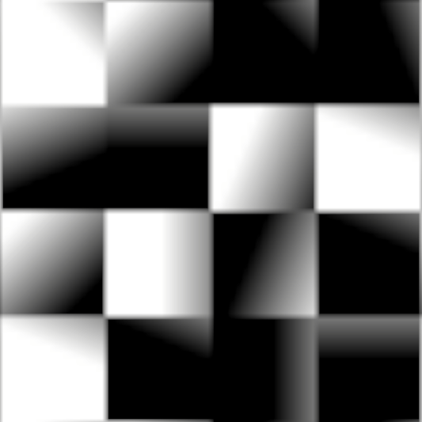
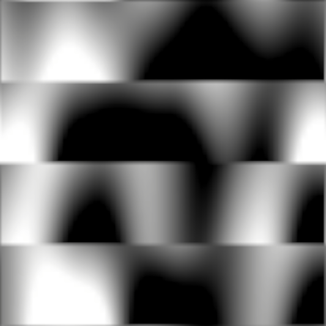
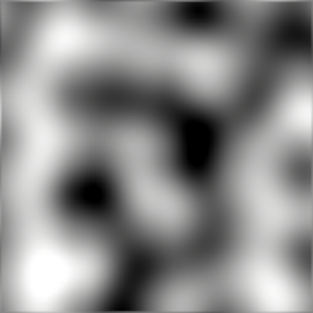
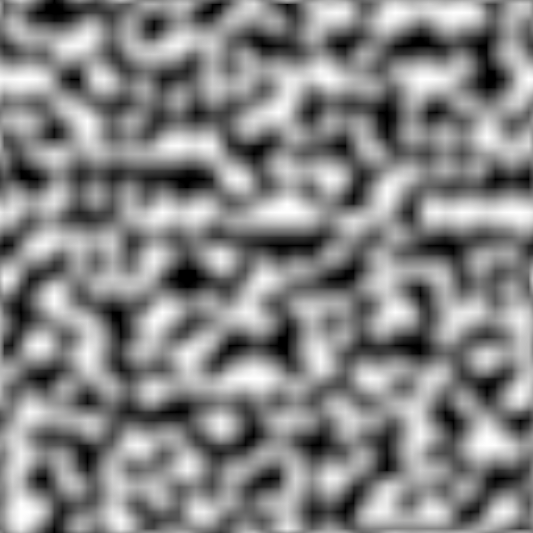
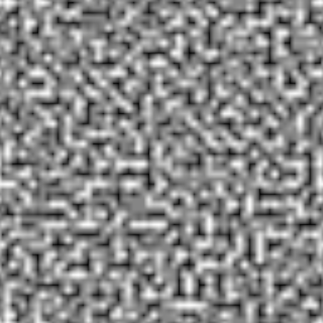
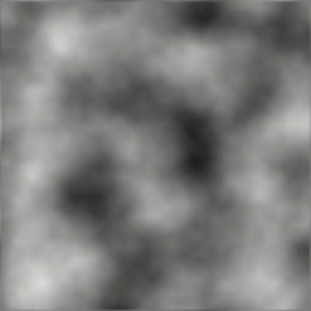
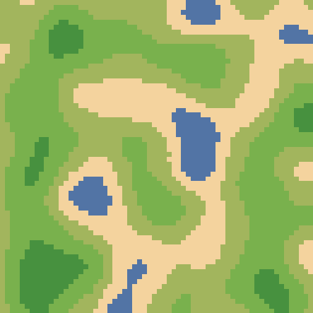

# Understanding Perlin Noise

## 1. Permutation and Random Numbers
In Perlin noise, we need a set of random values to compute the noise. This is done using a **permutation table**, which is generated using a **seed**. The seed ensures that the random values are reproducible. The permutation array is shuffled to provide randomness, and the table is used to generate pseudo-random gradients at each corner of the grid.

**Code snippet:**

```csharp
// Initialize and shuffle permutation array
permutation = new int[256];
for (int i = 0; i < 256; i++) permutation[i] = i;

// Shuffle permutation array for randomness
for (int i = 0; i < 256; i++)
{
    int swapIndex = random.Next(256);
    int temp = permutation[i];
    permutation[i] = permutation[swapIndex];
    permutation[swapIndex] = temp;
}
```

## 2. Vector Rotation
The gradient vectors are chosen based on the hash values in the permutation table. These vectors define the direction of the gradient at each corner of the grid. The vector directions are distributed evenly over 16 possible angles, each corresponding to a unique hash value.

## 3. Vector Dot Product
The dot product between the gradient vectors and the position relative to the corner is computed. This is used to determine how strongly each corner of the grid influences the noise value at a given point.

Code snippet:
```csharp
// Generate gradients as unit vectors based on the hash
float angle = (hash & 15) * Mathf.PI / 8;  // 16 possible angles (22.5° apart)
return Mathf.Cos(angle) * x + Mathf.Sin(angle) * y;
```

## 4. Dot Product with the Top-Left Corner
The first step in generating Perlin noise is to compute the dot product for the corner at the top-left of the grid cell. This gives us a gradient value based on the position relative to the top-left corner.


## 5. Dot Product with All Corners
Next, we compute the dot product for all four corners of the grid cell: top-left, top-right, bottom-left, and bottom-right.

   
 

Each of these corners has its own gradient vector that contributes to the final noise value.

## 6. Lerp the Top Gradients
To interpolate the top gradients, we perform linear interpolation (lerp) between the dot products of the top-left and top-right corners.


This interpolates between the two top gradients based on the relative position along the x-axis.

## 7. Lerp the Bottom Gradients
Similarly, we interpolate the bottom gradients, which are the dot products of the bottom-left and bottom-right corners.



This interpolates between the two bottom gradients based on their position along the x-axis.

## 8. Lerp Between Top and Bottom
Finally, we interpolate between the lerped top and bottom values based on the y-axis position to generate the final noise value for the grid cell.



## 9. First Octave of Perlin Noise
The process so far gives us the first octave of Perlin noise, which is a smooth gradient. This is the initial layer of noise.


## 10. Adding Multiple Octaves
Perlin noise is generated by stacking multiple octaves of noise. To achieve this, we divide the grid cell size by 2 and repeat the same process, each time adding more detail. Higher octaves have smaller grid sizes (higher frequency), and their influence decreases based on persistence.

### Second Octave


### Third Octave


### Fourth Octave


## 11. Merging the Octaves
Once all the octaves are generated, we merge them to create the final Perlin noise. Lower octaves contribute large, broad features, while higher octaves add finer details.



---

## Isn't This Fractal Noise?
Yes! This is fractal noise. Each octave is generated using the same process, but with different grid sizes and amplitudes. Despite being fractal in nature, it is still referred to as Perlin noise.

## In-Game Example
Here’s an example of how Perlin noise can be applied in a game, such as for generating terrain or textures.


